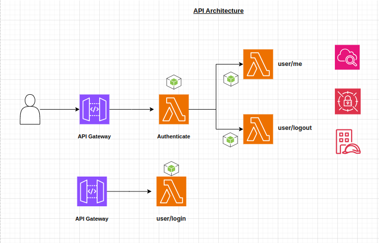

## Terraform setup for lambda APIs and CI/CD pipeline with GitHub Actions

## terraform setup
1. Create a bucket on AWS for environment specific, to keep the terraform state. just like (`terraform-dev-state-lambda-api-xyi-871`,  please refer the `backend-dev.hcl`, backend-staging.hcl and backend-production.hcl)
2. run `AWS_PROFILE=staging terraform init -reconfigure -backend-config="backend-staging.hcl"` to initiate the tf state on the bucket (default profile is development)

## terraform commands
1. AWS_PROFILE=production terraform plan
2. AWS_PROFILE=production terraform apply -auto-approve

## update the S3 permissions
`{
  "Version": "2012-10-17",
  "Statement": [
    {
      "Effect": "Allow",
      "Principal": {
        "AWS": "arn:aws:iam::ACCOUNT_ID:user/your-user-or-role"
      },
      "Action": [
        "s3:GetObject",
        "s3:PutObject",
        "s3:ListBucket"
      ],
      "Resource": [
        "arn:aws:s3:::terraform-staging-state-lambda-api-xyi-871",
        "arn:aws:s3:::terraform-staging-state-lambda-api-xyi-871/s3-github-actions/*"
      ]
    }`
  ]
}

